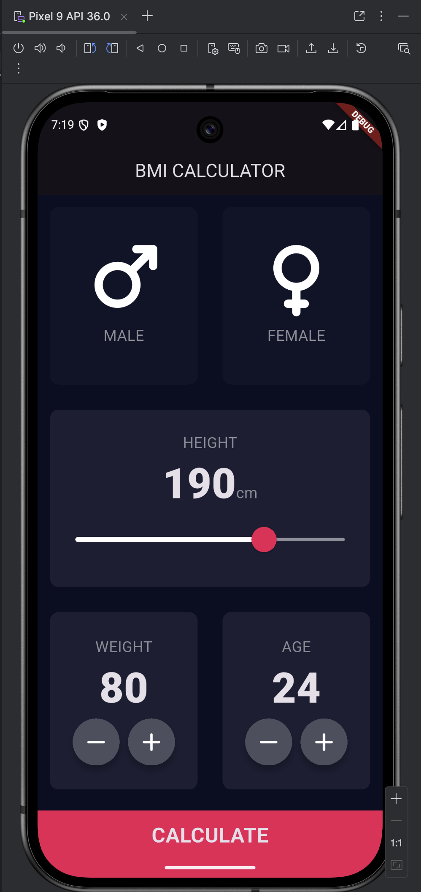
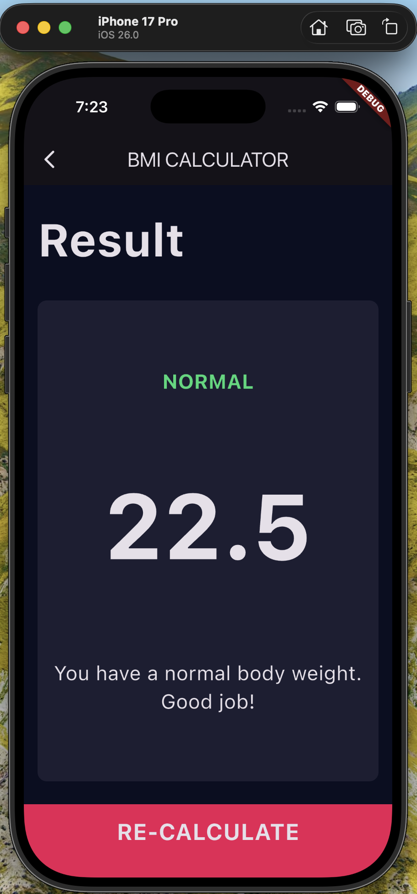

# BMI Calculator 💪

Welcome to the BMI Calculator, a sleek and intuitive Flutter application that helps you determine your Body Mass Index (BMI) with style! Whether you're on a fitness journey or just curious about your health, this app is your perfect companion.

## 🚀 Features

*   **Gender Selection:** Choose between male and female for a more personalized experience.
*   **Height and Weight Input:** Easily input your height and weight using a slider and intuitive buttons.
*   **Age Input:** Input your age for more context.
*   **Instant BMI Calculation:** Get your BMI result in a flash with a single tap.
*   **Detailed Results:** Understand your BMI with a clear result and a helpful interpretation.
*   **Beautiful UI:** A visually appealing interface with a dark theme that's easy on the eyes.
*   **Responsive Design:** Looks great on both Android and iOS devices.

## 📸 Screenshots

Here's a sneak peek of the app in action!

|                  Android                  |                iOS                |
|:-----------------------------------------:|:---------------------------------:|
|  |  |

## 🕹️ How to Use

1.  **Select your gender:** Tap on the male or female card.
2.  **Adjust your height:** Use the slider to set your height in centimeters.
3.  **Set your weight and age:** Use the plus and minus buttons to set your weight in kilograms and your age.
4.  **Calculate!** Tap the "CALCULATE" button to see your results.
5.  **View your results:** The results screen will show you your BMI, a result (e.g., "Normal", "Overweight"), and a friendly interpretation.
6.  **Re-calculate:** Tap "RE-CALCULATE" to go back and try different values.

## 💻 Technologies Used

*   **Flutter:** The UI toolkit for building beautiful, natively compiled applications for mobile, web, and desktop from a single codebase.
*   **Dart:** The programming language used to build Flutter apps.
*   **font_awesome_flutter:** For awesome icons.

## 🏁 Getting Started

To get a local copy up and running, follow these simple steps.

### Prerequisites

*   Flutter SDK: [https://flutter.dev/docs/get-started/install](https://flutter.dev/docs/get-started/install)
*   A code editor like VS Code or Android Studio.

### Installation

1.  Clone the repo
    ```sh
    git clone https://github.com/your_username_/BMI_Calculator.git
    ```
2.  Navigate to the project directory
    ```sh
    cd BMI_Calculator
    ```
3.  Install dependencies
    ```sh
    flutter pub get
    ```
4.  Run the app
    ```sh
    flutter run
    ```
